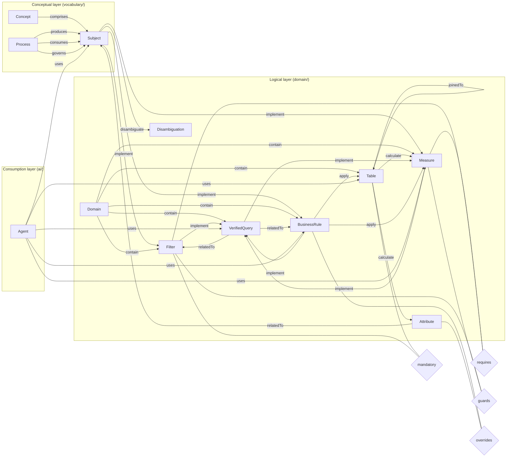

# Knowledge Graph Specification

**License:** [CC BY-NC 4.0](LICENSE)

---

## Table of Contents

1. [Goals](#1-goals)
2. [Terminology](#2-terminology)
3. [Data Model](#3-data-model)
4. [Link Format](#4-link-format)
5. [Space Structure](#5-space-structure)
6. [Page Templates](#6-page-templates)
7. [Versioning](#7-versioning)
8. [Agent Integration](#8-agent-integration)
9. [Tooling](#9-tooling)
10. [Backend Adapters](#10-backend-adapters)
11. [Version History](#11-version-history)

---

## 1. Goals

- **Centralize business knowledge** in a single, searchable location that both humans and AI agents can read.
- **Eliminate hallucinated business logic** in AI-generated SQL by grounding agents in structured, versioned definitions.
- **Encode semantics as a graph** — typed, directed edges between knowledge pages capture dependencies, rules, and relationships that plain text cannot.
- **Require no export pipeline** — knowledge lives where people write it; agents retrieve it at query time via semantic search.
- **Support incremental growth** — a single domain with two tables and three metrics is as valid as a graph with hundreds of nodes.

---

## 2. Terminology

| Term | Definition |
|---|---|
| **Node** | A single-topic page representing one business entity. Each node has a type, a unique name, and structured header fields. |
| **Node type** | The category of a node. Conceptual layer: `Concept`, `Subject`, `Process`. Logical layer: `Domain`, `Table`, `Measure`, `Attribute`, `Filter`, `VerifiedQuery`, `BusinessRule`, `Disambiguation`. Consumption layer: `Agent`. |
| **Edge** | A typed, directed link between two nodes. Encoded as a readable label embedded in the source page body. |
| **Edge kind** | The semantic verb describing the relationship: `implement`, `relatedTo`, `attribute`, `joinedTo`, `disambiguate`, `apply`, `contain`, `uses`. |
| **Owning side** | The page that declares the edge (source → target direction). |
| **Back-reference** | A convenience link on the target page pointing back to the source. Navigation only — not a separate semantic edge. |
| **Reification page** | A reified edge: a dedicated page for an edge that carries a `Reason` and `Consequence if Ignored`. Encoded as a page rather than a bare link. |
| **Reified edge kind** | An edge kind that requires a Reification page: `mandatory`, `requires`, `guards`, `overrides`, `demonstrates`. |
| **Domain** | A scoped collection of nodes tied to specific data tables and SQL expressions. |
| **Subject** | A global node (shared across all domains) that holds the business definition of a concept. |
| **Identity key** | The field whose value uniquely identifies a node within its type (always `name`). |

---

## 3. Data Model

The graph has three layers. Full layer specifications:
- Conceptual layer (node types, properties, edge kinds, stability test): [spec/conceptual-layer.md](spec/conceptual-layer.md)
- Logical layer (node types, properties, edge kinds, indexes, audit rules): [spec/logical-layer.md](spec/logical-layer.md)
- Consumption layer (the `Agent` node type, the `uses` edge kind, stability test): [spec/consumption-layer.md](spec/consumption-layer.md)

Machine-readable schema: [spec/schema.yaml](spec/schema.yaml)

> **Reification pages are not nodes.** They are reified edges — flattened into typed relationships with properties in any graph database export. They remain pages for human readability.

### 3.1 Schema diagram



> Rectangles = node types. Diamonds = reified edge kinds (Reification pages). Labelled arrows = hyperlink edge kinds. Only the owning direction is shown — back-references use the same verb with `←`.

---

## 4. Link Format

Full reference: [spec/link-format.md](spec/link-format.md)

Every edge is encoded as a **self-contained edge statement** embedded as the clickable label of a link in the page body:

```
Owning side (source page):
  [Source: SourceName edgeKind -> Target: TargetName]

Back-reference (target page):
  [Source: SourceName edgeKind <- Target: TargetName]

Reification page link (same label on both From and To pages):
  [Reification: X kind -> Y]
```

Rules:
- Use ASCII `->` and `<-` — not unicode arrows.
- All hyperlink edges live in a `## Links` section.
- Reification page links live in a separate `## Reifications` section.
- Back-references are navigation shortcuts only — not separate semantic edges.

### Back-reference constraints

1. **No symmetric duplicates.** If page A already owns `X edgeKind -> Y`, page A must **not** also carry `X edgeKind <- Y`.
2. **Back-reference edge kind must match the forward edge.** Derive the `<-` label by flipping the arrow in the owning label — never infer the kind from node types.
3. **`implement` is not valid between two Subjects.** Use `relatedTo` for Subject-to-Subject links.

---

## 5. Space Structure

Full reference: [spec/space-structure.md](spec/space-structure.md)

The knowledge base is organized as a **parent-container hierarchy**: a global `vocabulary/` container for the conceptual layer, a global `ai/` container for the consumption layer, and one container per domain for the logical layer. Page titles use a `<NodeType>: <Name>` prefix convention. See the full reference for the canonical hierarchy diagram, naming conventions, and container-page requirements.

---

## 6. Page Templates

Full reference: [spec/page-templates.md](spec/page-templates.md)

Each node type has a canonical template defining required header fields, section headings, and linking conventions. Key principles:

- **Prose belongs only on Subject and Disambiguation pages.** All other pages use structured header fields and a predicate/definition block — no explanatory paragraphs.
- **Keep all fields even if empty** — empty fields are valid; missing fields are not.
- **Semantic annotations on Table pages** use a `Calculated` column to link to Attribute or Measure pages. A node in the `Calculated` column must not also appear in `## Links` (duplicate).

---

## 7. Versioning

Full reference: [spec/versioning.md](spec/versioning.md)

The backend (wiki, git, etc.) versions every page update automatically, including the version number, timestamp, and author — this specification does not duplicate those into page content.

Every update must set the backend's **native** version comment (Confluence version message / git commit message) to a **structured summary**:

```
Summary: <one sentence>
Changed: <section or field>
Reason: <why>
Breaking: yes | no
```

**Breaking change** = any change that alters SQL construction or query interpretation (renamed node, changed predicate, removed mandatory filter). Mark `Breaking: yes` and propagate to dependent pages.

This specification uses [Semantic Versioning](https://semver.org):
- `MAJOR` — breaking: node type renamed/removed, edge kind removed, folder path changed, template field removed
- `MINOR` — additive: new node type, new edge kind, new template section
- `PATCH` — clarification, wording fix, non-breaking convention update

---

## 8. Agent Integration

> **Terminology note.** "Agent" in this section means any AI system reading the knowledge base — the generic sense used throughout this spec. `Agent` the node type (capitalized, [spec/consumption-layer.md](spec/consumption-layer.md)) is a specific, narrower thing: a page representing one named consumption surface (a Cortex Agent, a Claude/Cursor Skill) and what it's for. Every agent in the generic sense should follow the workflow below; only some of them will also have a corresponding `Agent` page.

### How agents consume the knowledge base

Agents must query the knowledge base **before writing any SQL** and **before answering any business question**. The graph encodes the correct SQL construction pattern:

1. **Start at the Measure.** Read its SQL definition — this is the aggregate expression.
2. **Follow reified edges** (`requires`, `mandatory`) to find Filter pages. Every mandatory filter must appear in the `WHERE` clause.
3. **Follow `relatedTo`** to find BusinessRule pages. Each rule specifies additional `WHERE` conditions or computation patterns.
4. **Check for Disambiguation** if the question contains an ambiguous term. Present the clarifying question to the user before generating SQL.
5. **Use VerifiedQuery pages** as reference implementations. If an exact match exists, return or adapt the verified SQL rather than generating from scratch.
6. **Check Attribute pages** for columns with derived expressions — use the expression from the Attribute page, not a raw column reference.
7. **Never fabricate business logic** — if a rule or filter is not found in the knowledge base, state that explicitly.

### When to search for which node type

| Situation | Node type to retrieve |
|---|---|
| User asks about a KPI or measure | `Measure: <name>` |
| User asks what a term means | `Subject: <term>` or `Disambiguation: <term>` |
| User asks about filters for a table | Reified edges where kind = `mandatory` and target = `<table>` |
| User asks for a known query pattern | `VerifiedQuery: <topic>` |
| User asks about a business rule | `Rule: <name>` |
| Ambiguous term in the question | `Disambiguation: <term>` — ask the clarifying question first |
| User asks about a column or derived field | `Attribute: <name>` |
| User asks what an existing agent/skill can answer, or which agent to use | `Agent: <name>` — or `uses <-` back-references on the node in question to find agents that already read it |

### Semantic search strategy

Use **natural-language phrases describing intent**, not exact page titles:

```
"mandatory filters for <table name>"
"how is <measure> computed"
"what does <term> mean in <domain>"
"SQL example for <question>"
"rule for excluding <condition>"
"disambiguation for <ambiguous term>"
"derived expression for <column>"
```

When search returns multiple results, prefer the page whose title prefix matches the needed node type.

---

## 9. Tooling

Reference implementations and tooling design are documented in `adapters/`:

| Document | Purpose |
|---|---|
| [adapters/engine/confluence/snapshot-pipeline.md](adapters/engine/confluence/snapshot-pipeline.md) | Crawl pages → JSON snapshot → interactive graph visualization |
| [adapters/engine/confluence/graph-api.md](adapters/engine/confluence/graph-api.md) | Knowledge Graph API for programmatic graph operations (bulk updates, migration, graph DB import) |
| [adapters/engine/confluence/agent-skill.md](adapters/engine/confluence/agent-skill.md) | Agent operational spec: five workflows with step-by-step instructions |

---

## 10. Adapters

The spec is backend-agnostic. Adapters connect the Knowledge Graph to storage systems, graph databases, and source systems. The full adapter taxonomy — engine adapters, connectors, and addons — is defined in [`adapters/adapters.md`](adapters/adapters.md).

---

## 11. Version History

See [CHANGELOG.md](CHANGELOG.md) for the full release history.
